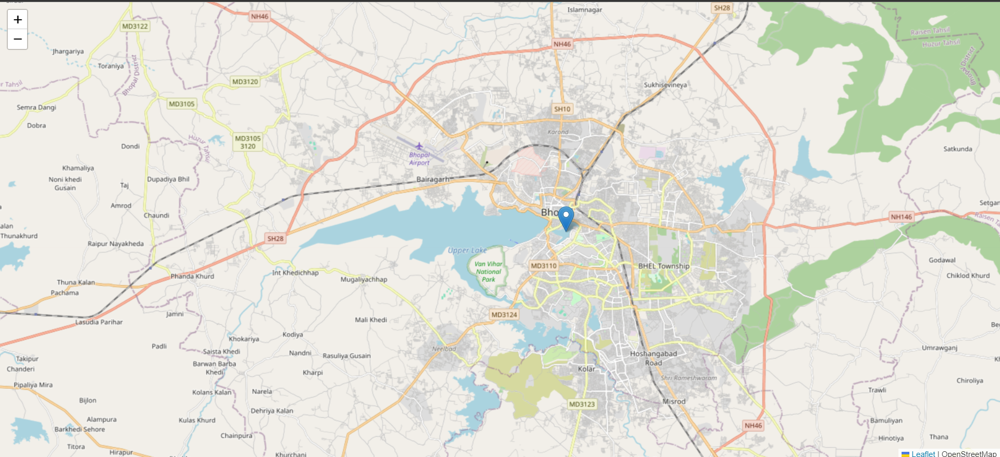
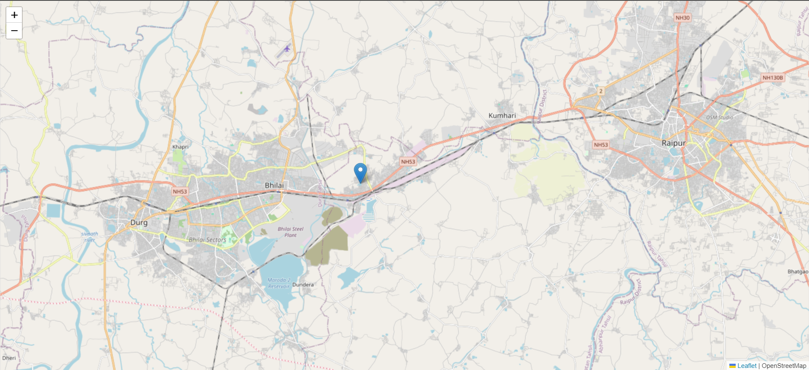

# Realtime Tracker Application

This is a real time tracker built in Javascript, EJS with a touch of CSS. Socket.io framework is used for realtime tracking in this application. Leaflet Library is used for including maps in this Application.

## Codes And Additionals

This is a simple step-by-step synopsis of the code.

First Download the application in the form of a ZIP File. Install the required packages.

```bash
  npm i
```

Then run

```bash
  npx nodemon app.js
```

Make sure to allow the access it asks for tracking the real location.

## Screenshots

- Screenshot 1 



- Screenshot 2


